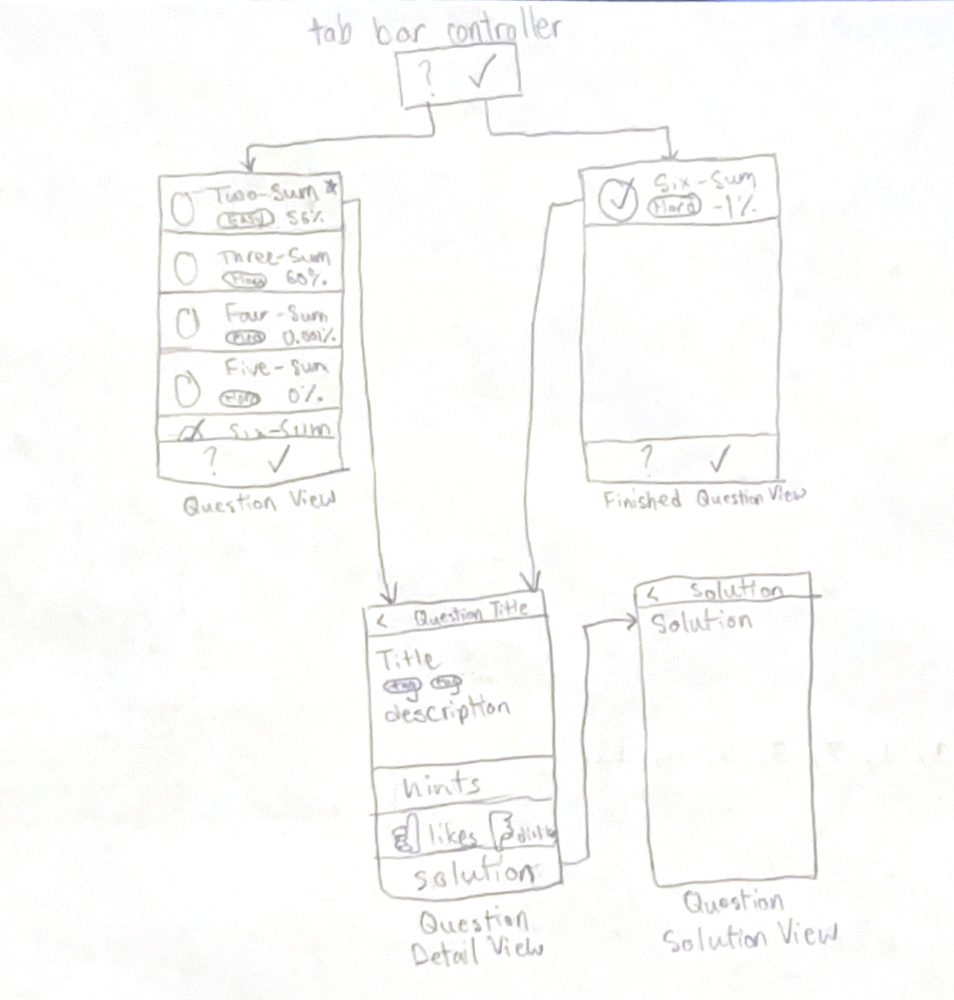

# Mobile Technical Interview Platform

## Table of Contents

1. [Overview](#Overview)
2. [Product Spec](#Product-Spec)
3. [Wireframes](#Wireframes)
4. [Schema](#Schema)

## Overview

### Description

The problem is that people in the field of Computer Science or related fields want to be able to prepare for technical interviews from the convenience of their phones. This solution allows users finally live their dreams of being the best technical interviewer ever without the limitations of a laptop or desktop to practice technical interviews on websites like Leetcode.

### App Evaluation

- **Category:** Educational/Professional Development
- **Mobile:** Mobile is essential for convenience of use. Users may also want to receive notifications to do their daily technical problem. A possible feature would be scanning hand written code into the app via camera to simulate "whiteboard" technical interviews.
- **Story:** This platform allows users to conveniently do technical interviews from their phone. This allows users to practice when they are using public transportation, walking, or in the car while someone else is driving (practicing and driving is not safe and not encouraged). This encourages users to hone in on their technical interview skills in a job market where any edge can be the difference between being a full-time software engineer at Uber or being a part-time dispatch specialist at Uber (an Uber driver).
- **Market:** According to [DataUSA](https://datausa.io/profile/cip/computer-science-110701), 2.32 million people are in the field of Computer Science. The amount of people that should be staying Leetcode sharp should be 2.32 million people because in today's current job climate it is always better to be safe and prepared. This product could be monetized through a paid membership allowing users access to more resources.
- **Habit:** An average user could use this on a day-to-day basis to keep their streak of one technical interview preparation question per day or some users may use this constantly through the day to grind.
- **Scope:** V1 would display Leetcode's daily question and a list of 10 - 12 questions for users. Users are allowed to see the daily question and more questions from the convenience of their phone. V2 would allow users to select questions that they have finished and implement a notification system letting the user know that the daily question hasn't been selected to be finished. Users can organize which questions they have solved versus questions they need to solve.  Users will be held accountable to at least select that their daily question is solved. V3 would implement a code editor into the app and test cases for each question. Users would be able to implement, test, and submit their solutions.

## Product Spec

### 1. User Stories (Required and Optional)

**Required Must-have Stories**

* Users can see the daily question
* Users can see the list of questions
* Users can selected which questions have been solved from the list of questions
* Users can enable notifications to remind them to do their daily question if it isn't done by 5:00 PM in their time.
* Users can view solutions of the daily question

**Optional Nice-to-have Stories**

* Users can implement their solutions
* Users can test their solution with given test cases
* Users can submit their solution that will be tested among more test cases to test the validity of the solution

### 2. Screen Archetypes

- [ ] Question Stream
* User can view daily question that will be at the top denoted by a star
* User can view other questions and scroll through the questions
* User can select questions that they finished
- [ ] Question Detail
* User can view details and hints about question
* User can press button to send them to solution screen (if the question is the daily question)
- [ ] Question Solution
* User can view the solution

### 3. Navigation

**Tab Navigation** (Tab to Screen)

* Question Stream
* Finished Questions

**Flow Navigation** (Screen to Screen)

- [ ] Questions Stream (when you press on a question)
* => Question Detail
- [ ] Finished Questions (when you press on a question)
* => Question Detail
- [ ] Question Detail (when you press on solution button)
* => Question Solution

## Wireframes

[Add picture of your hand sketched wireframes in this section]

### [BONUS] Digital Wireframes & Mockups

### [BONUS] Interactive Prototype

## Schema 

[This section will be completed in Unit 9]

### Models

[Add table of models]

### Networking

- [Add list of network requests by screen ]
- [Create basic snippets for each Parse network request]
- [OPTIONAL: List endpoints if using existing API such as Yelp]
